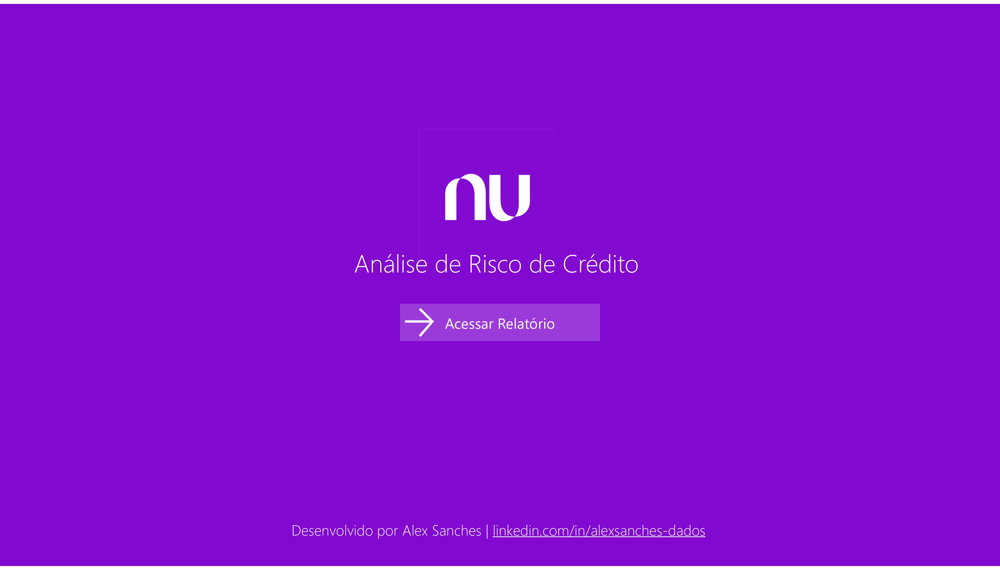
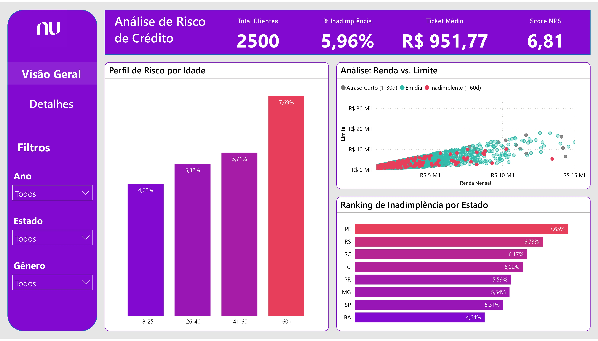
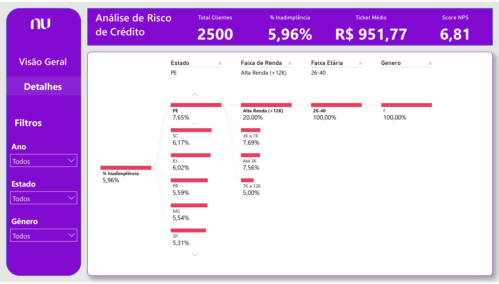

# 📉 Case de Estudo: Análise de Risco de Crédito (Cenário Nubank)

Este projeto simula a atuação de um Analista de Risco focado em mitigar a inadimplência (Churn/Default), utilizando uma base de dados fictícios para validar hipóteses de negócio.

---

## 📊 Principais Insights de Negócio
Durante a análise exploratória, identifiquei padrões críticos para a tomada de decisão estratégica:

1. **Paradoxo da Idade:** Contrariando o senso comum de mercado, o público **Sênior (acima de 60 anos)** apresentou a maior taxa de risco da carteira (**7,69%**), quase o dobro dos jovens de 18-25 anos (**4,62%**).
2. **Geografia da Inadimplência:** O estado de **Pernambuco** liderou o ranking de risco (**7,65%**), enquanto a Bahia (**4,64%**) se mostrou um porto seguro para expansão de crédito.
3. **Cluster Crítico (100% de Risco):** Utilizando a Árvore de Decomposição (IA), isolei um micro-segmento específico (Alta Renda em PE, faixa 26-40 anos) onde **todos os clientes** estavam inadimplentes. Um alerta vermelho para bloqueio imediato.

---

## 📸 Galeria do Projeto

### 1. Capa e Navegação (UX)
Interface desenhada com a identidade visual da marca, focada em navegação intuitiva similar a um aplicativo.

### 2. Visão Geral (KPIs e Dispersão)
Painel tático correlacionando Renda vs Limite e identificando os ofensores de inadimplência por região e idade.

### 3. Deep Dive (Árvore de Decomposição)
A técnica utilizada para encontrar a "causa raiz" e o segmento de 100% de risco mencionado nos insights.

---

## 🛠 Tecnologias Utilizadas
- **Power BI:** ETL, Modelagem Star Schema e Visualização.
- **DAX:** Medidas para Share de Carteira e Análise Temporal.
- **Estatística:** Correlação e detecção de outliers (Gráfico de Dispersão).

---
Desenvolvido por **Alex Sanches** | [Conecte-se no LinkedIn](https://www.linkedin.com/in/alexsanches-dados/)
